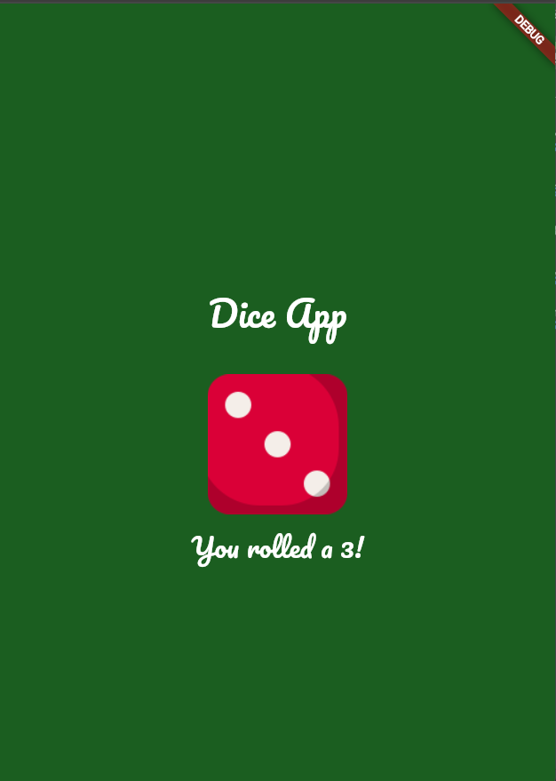

# 🎲 Dice App

A simple Flutter app to roll virtual dice.

---

## 📸 App Screenshot

### 🎯 Dice Screen


> 📂 Make sure to add the screenshot image inside the `screenshots/` folder at the root of your project directory.

---

## 🚀 Getting Started

This project is a starting point for a Flutter application.

A few helpful resources to begin:

- [Lab: Write your first Flutter app](https://docs.flutter.dev/get-started/codelab)
- [Cookbook: Useful Flutter samples](https://docs.flutter.dev/cookbook)

For more assistance, visit the [Flutter documentation](https://docs.flutter.dev/), which includes tutorials, samples, and API references.

---

## 🛠️ Installation

Follow these steps to set up and run the app:

1. **Clone the repository:**
   ```bash
   git clone https://github.com/your-username/dice_app.git
2. Navigate to the project directory
   ```bash
   cd bmi
3. Install the required dependencies:
   ```bash
   flutter pub get
4. Run the app:
   ```bash
   flutter run